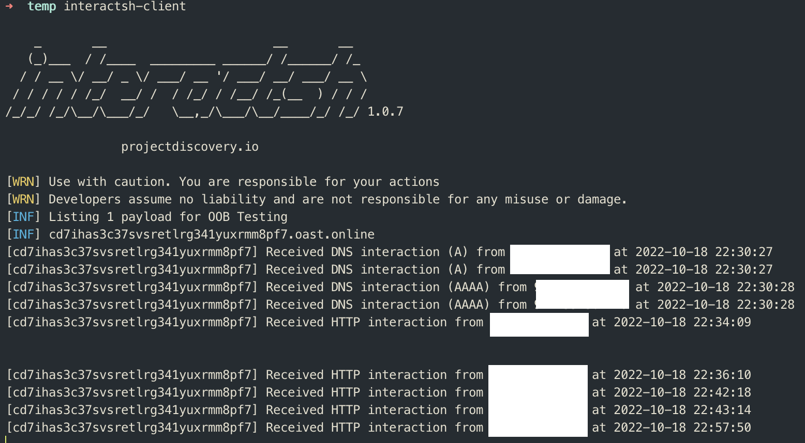

# CVE-2022-42889-POC
A simple application that shows how to exploit the CVE-2022-42889 vulnerability.   
Utilizes OOB (Out of Band) services to demonstrate dns and url prefixes.

JavaDocs for commons-text interpolation [commons-text JavaDocs](https://commons.apache.org/proper/commons-text/javadocs/api-release/org/apache/commons/text/StringSubstitutor.html)

Example interpolations
* script:javascript
* dns
* url 

Quote from Rapid7
>The vulnerability has been compared to Log4Shell since it is an open-source library-level vulnerability that is likely to impact a wide variety of software applications that use the relevant object.   
>However, initial analysis indicates that this is a bad comparison. The nature of the vulnerability means that unlike Log4Shell, it will be rare that an application uses the vulnerable component of Commons Text to process untrusted, potentially malicious input.
# Prerequisites
* docker
* java
* maven

Java and maven can be skipped if one fetch image from [Docker Hub](https://hub.docker.com/r/korteke/text4shell)
# Usage

Build application
```
mvn clean package
```

Build docker image
```
docker build -t cve-2022-42889-poc .
```

Run docker image
```
docker run --rm -p 8081:8081 -t cve-2022-42889-poc
```

Access application and follow instructions
```
open https://localhost:8081
```

Check that the vulnerability creates a new file in the /tmp/ directory (/tmp/blop)
```
➜  ~ docker exec -ti cve-2022-42889-poc /bin/ls /tmp

blop		 tomcat-docbase.8081.12439436974042217796
hsperfdata_root  tomcat.8081.2549096106233509364
➜  ~
```

#### UI


#### Network interaction proof. Tested with local interactsh-client.


### More information
* [NIST NVD](https://nvd.nist.gov/vuln/detail/CVE-2022-42889)
* [Rapid 7](https://www.rapid7.com/blog/post/2022/10/17/cve-2022-42889-keep-calm-and-stop-saying-4shell/)